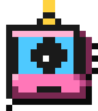
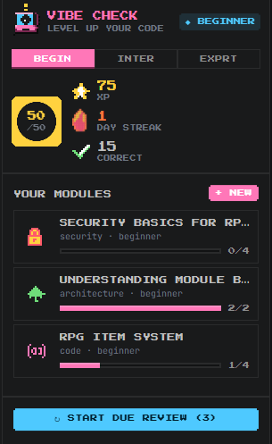
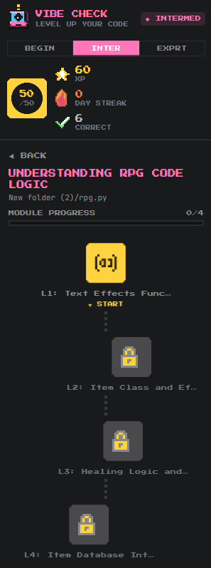
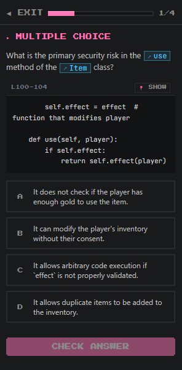
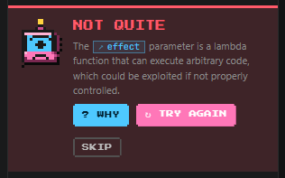
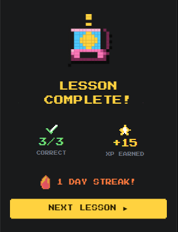

<div align="center">



# Vibe Check

**Anti-vibe-coding mentor.** When AI writes code for you, Vibe Check turns it into a Duolingo-style quiz so you actually understand it.

[](https://open-vsx.org/extension/cognitra/vibe-check)
[](LICENSE)

</div>

Inspired by Duolingo's mastery loops and Brilliant's interactive learning, Vibe Check intercepts large AI-generated code insertions and turns them into structured, gated learning modules — complete with spaced repetition, three difficulty tracks, and an XP/streak system.

Built for **Google Antigravity, Cursor, Windsurf, VSCodium, VS Code**, and any other VS Code-compatible editor.

---

## Why?

You ship code an agent wrote. A week later, it breaks. You can't fix it because you never understood it. Vibe Check makes that impossible.

- An agent inserts >5 lines? **A multi-lesson module spawns automatically** — 2-5 lessons, sized to the chunk of code.
- Auto-fired modules quiz the same code from multiple angles: what does it do, security implications, where it fits in the architecture, what tools it touches.
- You read each line, then prove it with closed-question quizzes (multiple choice, fill-in-the-blank, drag-to-reorder).
- Pass with ≥80% to unlock the next lesson. Fail and you stay stuck — or skip with a streak hit.
- Questions you answered live in a spaced-repetition queue. Tomorrow Vibe Check asks you the trickiest ones again.

No fluff, no free-text gotchas, no LLM grading you on vibes. Closed questions, deterministic grading, pixel-art mascot judging your every wrong answer.

---

## Screenshots

<table>
<tr>
<td width="50%" valign="top">

<p><em>Home — pick a track, see your XP/streak, jump back into modules.</em></p>
</td>
<td width="50%" valign="top">

<p><em>Module path — five sequential lessons, each locked behind the last.</em></p>
</td>
</tr>
<tr>
<td width="50%" valign="top">

<p><em>A question in flight — the exact code block is shown above the options, click <strong>📍 SHOW</strong> to jump to it in the editor.</em></p>
</td>
<td width="50%" valign="top">

<p><em>Wrong answer? Get the canonical explanation free, or click <strong>? WHY</strong> for a personalized one that points at <em>your</em> mistake.</em></p>
</td>
</tr>
<tr>
<td colspan="2" align="center" valign="top">

<p><em>Lesson complete — score, XP earned, streak bumped. Next lesson unlocks.</em></p>
</td>
</tr>
</table>

---

## Install

### Antigravity / Cursor / Windsurf / VSCodium

Open the Extensions panel, search **Vibe Check**, click Install.

### VS Code

Vibe Check is published to [Open VSX](https://open-vsx.org/), not Microsoft's Marketplace. To install in the official VS Code:

1. Download the latest `.vsix` from the [Open VSX page](https://open-vsx.org/extension/cognitra/vibe-check)
2. In VS Code: **Extensions panel → "..." menu → Install from VSIX...** → pick the file

Or via terminal:

```bash
code --install-extension vibe-check-X.Y.Z.vsix
```

---

## Quick start

1. **Open the sidebar.** Click the 🎓 mortarboard icon in the activity bar.
2. **Set your model provider.** Run `Vibe Check: Configure Provider` from the Command Palette — guided wizard picks provider, prompts for API key (encrypted SecretStorage), and selects a model in one flow. In VS Code with Copilot active, `copilot` works with no API key.
3. **Trigger a quiz.** Either let an AI agent insert >5 lines into your editor (the Pulse Observer auto-fires), or:
   - Click **+ NEW** in the sidebar header → pick a topic
   - Right-click code → **Vibe Check: Quiz Me On Selection**
4. **Take the lesson.** 3-5 questions, sized to the chunk. Pass with ≥80% to unlock the next.
5. **Use keyboard shortcuts** in lessons: `1` `2` `3` `4` to pick A/B/C/D, `Enter` to submit and to advance.
6. **Daily review.** Click **↻ START DUE REVIEW** when due cards exist.

---

## Features

### Five lesson topics

| Topic | Source | Use it for |
|---|---|---|
| 📝 **Code** | Active editor selection or full file | Quizzing on code an agent just wrote |
| 🏗️ **Infrastructure** | `package.json`, `tsconfig.json`, eslint config, build configs, Dockerfile, CI workflows | Understanding the build/config layer |
| 🛠️ **Tools** | `package.json` deps & scripts | Knowing what each library does |
| 🧱 **Architecture** | Project directory tree | Understanding module boundaries |
| 🔐 **Security** | Active file (or project config) | Spotting injection vectors, validation gaps |

### Three difficulty tracks

- **Beginner** — recognition and recall (5 XP per correct answer)
- **Intermediate** — applied logic, predict outputs (10 XP)
- **Expert** — architecture, edge cases, trade-offs (20 XP)

Track is a **difficulty preference** — it controls how hard the LLM makes new lessons and how much XP each correct answer is worth. **XP, streak, daily progress, modules, and the review queue are shared across all three tracks** (since v0.1.1). Switch freely.

### Question types

- **Multiple choice** — one prompt, four plausible options, one correct. Inline code preview shows the exact block being asked about. Options are seeded-shuffled host-side so the correct answer is uniformly distributed across A/B/C/D
- **Fill in the blank** — code shown with a highlighted gap, pick from four candidates what fills it correctly
- **Code ordering** — shuffled lines you reorder via drag-and-drop, with a snap-to-place drop indicator

### Smart editor integration

- **📍 SHOW** button on each code block opens the source file and highlights the referenced lines.
- **Backtick code references in prompts** are clickable. When the LLM writes a question like *"What does `Map.get(key)` return when…"*, click `Map.get(key)` and Vibe Check finds and highlights that exact text in your source.
- **Auto-glow** highlights the relevant code passively as you advance through a lesson.

### Optional personalized feedback

Got a question wrong? The default explanation is canonical and free. Click **? WHY** to ask the LLM for a personalized explanation that points at *your specific mistake*. Skip it and pay nothing.

### XP, streaks, daily ring

- Daily XP ring fills toward a 50-XP goal — work a little every day.
- One shared streak counts consecutive days you answered ≥1 question correctly (any track).
- **Streak freeze** ❄ — earn 1 freeze per 7-day streak (capped at 3). If you miss a day with a freeze, the streak is preserved automatically on your next review.
- Cross-device sync via VS Code Settings Sync — your XP and streak follow you. Modules and review cards stay per-project (workspace-state).

### Keyboard, shortcuts, and quality-of-life

- Lessons: **`1`–`4`** picks A/B/C/D, **`Enter`** submits and advances.
- **Thumbs up/down** on every question — anonymous feedback that helps tune prompts.
- **Cancel-generation** button on the GENERATING overlay so you don't sit through a slow LLM call.
- **Delete a module** ✕ on each card if you want to clean up without nuking your XP.

---

## Supported AI providers

| Provider | Set up | Best for |
|---|---|---|
| **GitHub Copilot** (`vscode.lm`) | Just sign into Copilot in VS Code — no key needed | Free if you have Copilot |
| **Anthropic Claude** | Get a key at [console.anthropic.com](https://console.anthropic.com/settings/keys) | Best educational explanations |
| **Google Gemini** | Get a key at [aistudio.google.com](https://aistudio.google.com/app/apikey) | Cheapest at scale |
| **OpenAI** | Get a key at [platform.openai.com](https://platform.openai.com/api-keys) | Most familiar |
| **OpenRouter** | Get a key at [openrouter.ai](https://openrouter.ai/keys) | One key, 100+ models |

> ⚠️ **Antigravity / Cursor / Windsurf users:** these editors **don't currently expose their built-in AI to extensions** (Antigravity SDK is for "agents using your tools", not "your tools using the agent"; Cursor explicitly doesn't support `vscode.lm`). You'll need to set up a direct provider (Anthropic, Gemini, OpenAI, or OpenRouter) — Vibe Check uses it via API key. Run **`Vibe Check: Configure Provider`** from the command palette to set up in one guided flow.

API keys are stored encrypted in VS Code SecretStorage — they never sync to Settings Sync, never end up in `settings.json`. Set, clear, and rotate them via the command palette.

---

## Commands

| Command | Description |
|---|---|
| `Vibe Check: New Module...` | Open the topic picker to generate a fresh module |
| `Vibe Check: Quiz Me On Selection` | Generate a code module from your current editor selection |
| `Vibe Check: Start Due Review` | Run FSRS-due questions from this workspace |
| `Vibe Check: Switch Track` | Change between beginner / intermediate / expert (difficulty preference) |
| `Vibe Check: Reset Progress` | Wipe all XP, streaks, modules, and FSRS cards |
| `Vibe Check: Configure Provider (Setup Wizard)...` | Single guided flow — pick provider, paste key, select model |
| `Vibe Check: Switch Provider...` | Change which LLM backend Vibe Check uses |
| `Vibe Check: Select Model...` | Pick a specific model from the active provider's catalog |
| `Vibe Check: Set API Key...` | Save an API key for a direct provider (encrypted) |
| `Vibe Check: Clear API Key...` | Wipe a stored API key |
| `Vibe Check: Open Get Started Walkthrough` | Re-open the 5-step onboarding |
| `Vibe Check: Telemetry Settings…` | Grant / deny / reset anonymous telemetry consent |

---

## Settings

| Setting | Default | What it does |
|---|---|---|
| `vibeCheck.autoQuiz` | `true` | Auto-fire a quiz when the Pulse Observer detects a large AI insertion |
| `vibeCheck.modelProvider` | `auto` | Which backend to use (`copilot`, `antigravity`, `anthropic`, `gemini`, `openai`, `openrouter`, or `auto`) |
| `vibeCheck.<provider>Model` | `""` | Per-provider model override — leave empty for sensible defaults |
| `vibeCheck.telemetry.enabled` | `null` | `null` = ask once on first run; `true` = anonymous telemetry on; `false` = off |
| `vibeCheck.telemetry.endpoint` | `""` | Power user — point at your own Supabase ingest URL, or set to `disabled` to hard-block transport |

Open the Settings UI and search "vibe check" to see them all with descriptions.

---

## Privacy

- API keys are stored in **VS Code SecretStorage** (encrypted, never synced).
- Code context sent to LLMs is bounded: 5 KB per file, 16 KB total per generation.
- Your XP, streaks, modules, and quizzes live in `globalState` / `workspaceState` on your machine.
- **Anonymous telemetry is opt-in and asked once** on first activation. We collect only anonymous counts and timings (lessons completed, question types answered, latency per provider, errors). **No code, no file contents, no API keys, no personal info.** Full field-by-field disclosure in [PRIVACY.md](PRIVACY.md). Toggle anytime via `Vibe Check: Telemetry Settings…`. Honored alongside `telemetry.telemetryLevel`.

---

## Known limitations

- **Pulse heuristic is coarse.** Any insertion ≥200 chars or ≥5 lines triggers a module. Large pastes from non-AI sources also trigger.
- **Antigravity agent-artifact hook is speculative.** Probed defensively; falls back to text-change detection if the API surface changes.
- **Code-order questions need unique lines.** Duplicate lines get filtered during generation; rare but possible to lose a question to this.
- **Custom OpenAI-compatible endpoints aren't yet exposed in settings.** Want Ollama/LM Studio/local? See [DEVELOPMENT.md](DEVELOPMENT.md) for the one-line workaround.

---

## License

MIT — see [LICENSE](LICENSE).

---

**Combat vibe coding. Ship code you actually understand.**
